# Shrinkwrap JOSM Plugin: Examples

Also see: [usage](USAGE.md)  

* [landuse=residential around buildings](#landuseresidential-around-buildings)
* [Copying a way](#copying-a-way)
* [leisure=park enclosed by walls](#leisurepark-enclosed-by-walls)

Any other examples are welcome!

## landuse=residential around buildings

If you use the [landuse=residential-on-buildings scheme](https://wiki.openstreetmap.org/wiki/Tag:landuse%3Dresidential#Separation_from_roads), you can use [*Convex Hull*](USAGE.md#Convex%20Hull) to quickly draw the outer way:

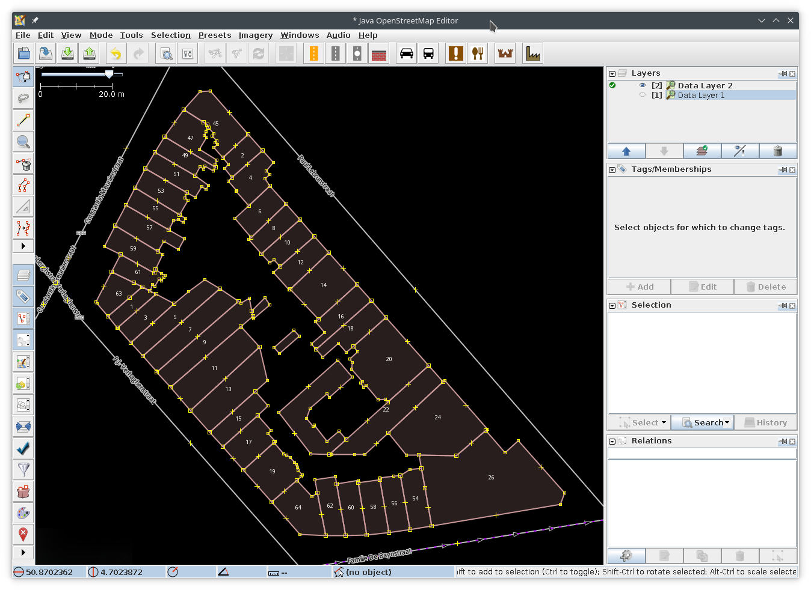

Select the buildings and activate *Convex Hull*.

Add landuse tag.
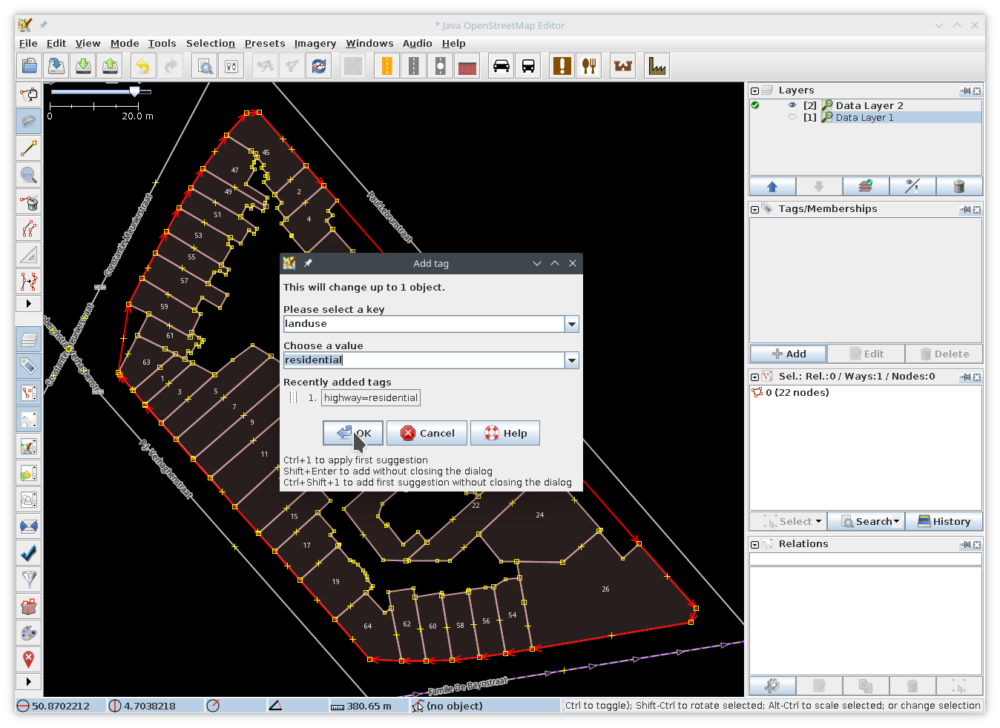

Done
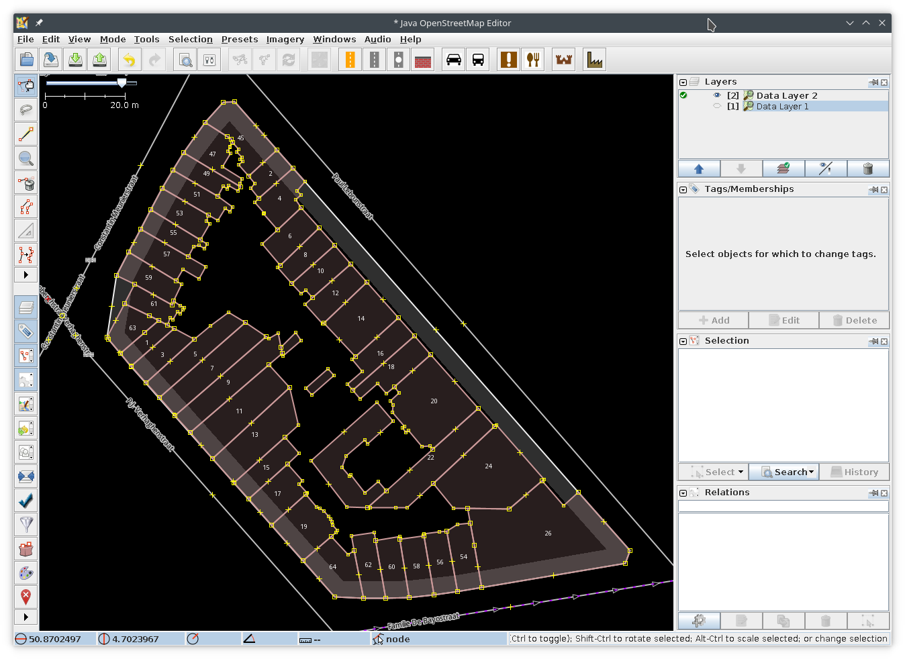

Alternatively you can use [*Shrinkwrap*](USAGE.md#Shrinkwrap) to fill in the holes on the NE-side.

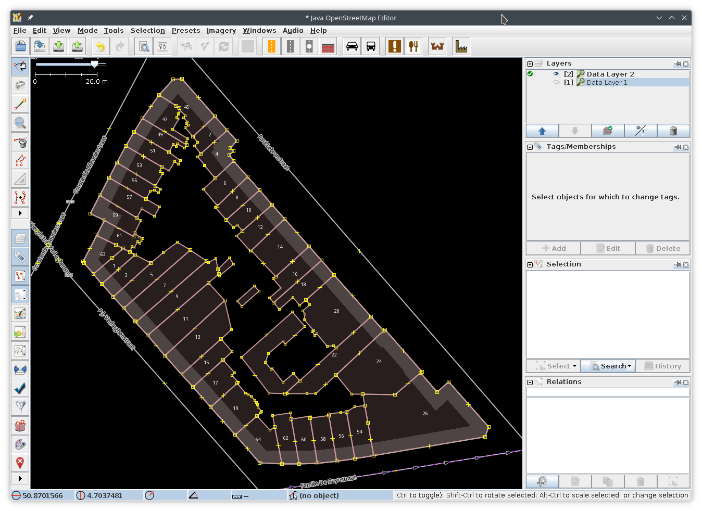

## Copying a way

Say you want create a way that's just a little different from an existing one. Just select the way and use [*Shrinkwrap*](USAGE.md#Shrinkwrap) to make a copy.

As an example I want to create way for the leisure=park within this tourism=museum, but that way needs to wrap around the main building.

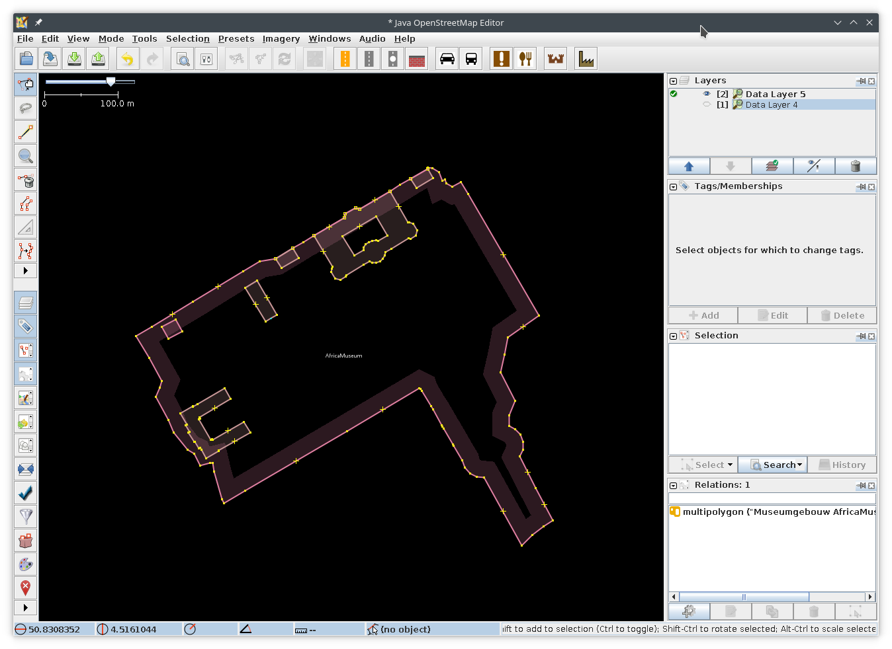

Select the way I want to copy and activate *Shrinkwrap*.
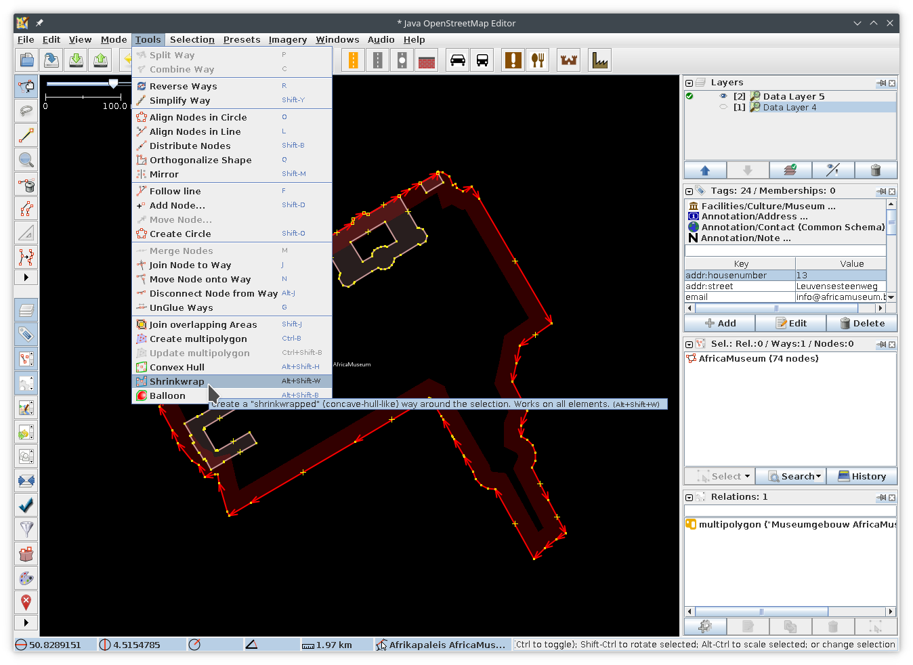

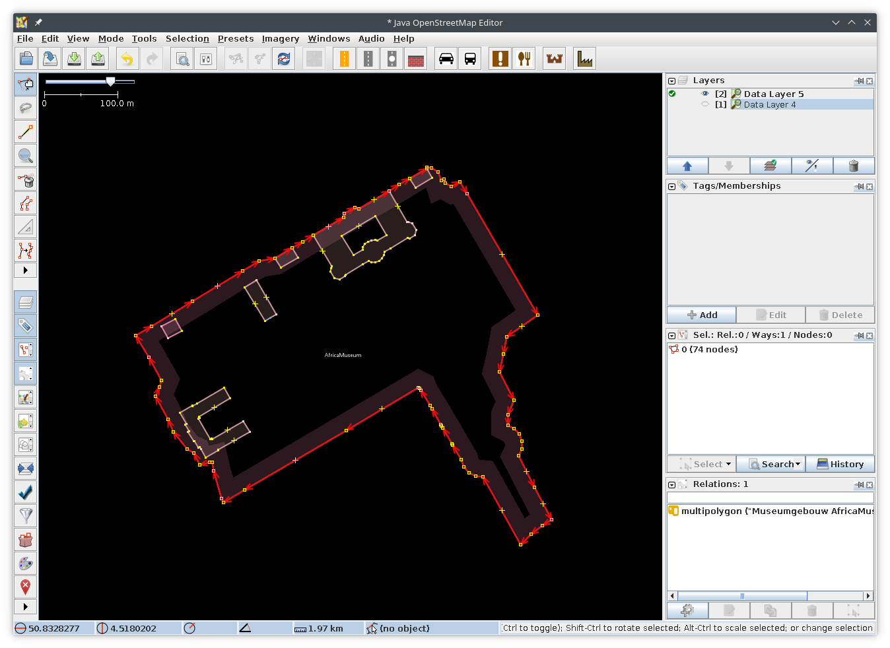

Modify the new way to wrap around the building. 
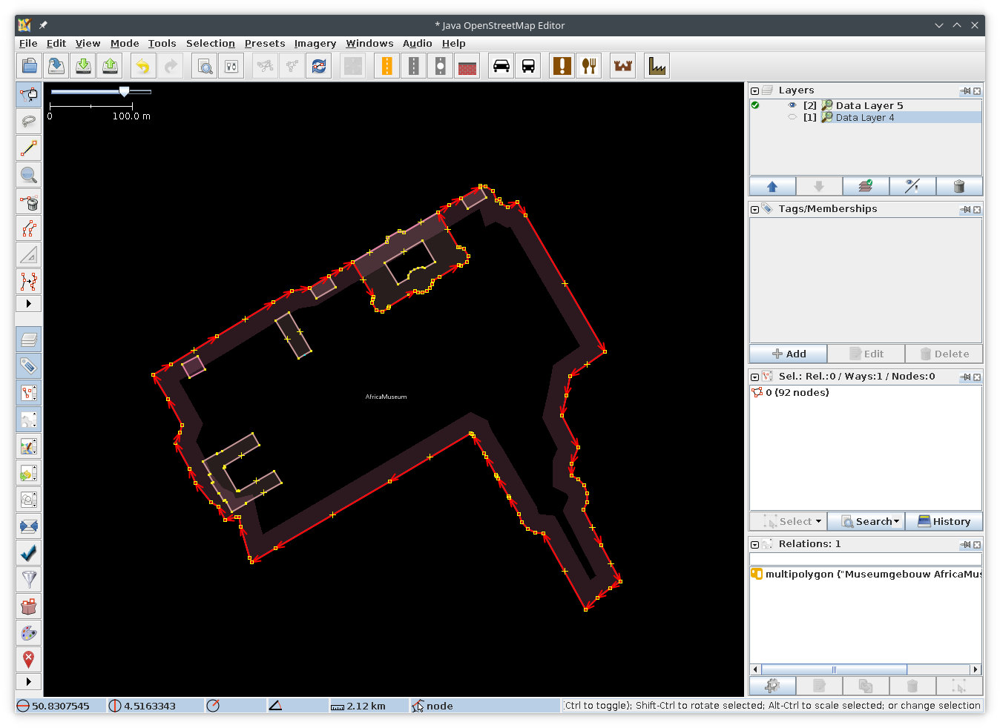

You could of course also solve this with multipolygons.

## leisure=park enclosed by walls

I already mapped all the buildings and walls enclosing this park.

To add the inner leisure=park way without having to press [Ctrl+f](https://josm.openstreetmap.de/wiki/Help/Action/FollowLine) a million times I can use *Balloon*.

*Notice the cursor within the empty area*
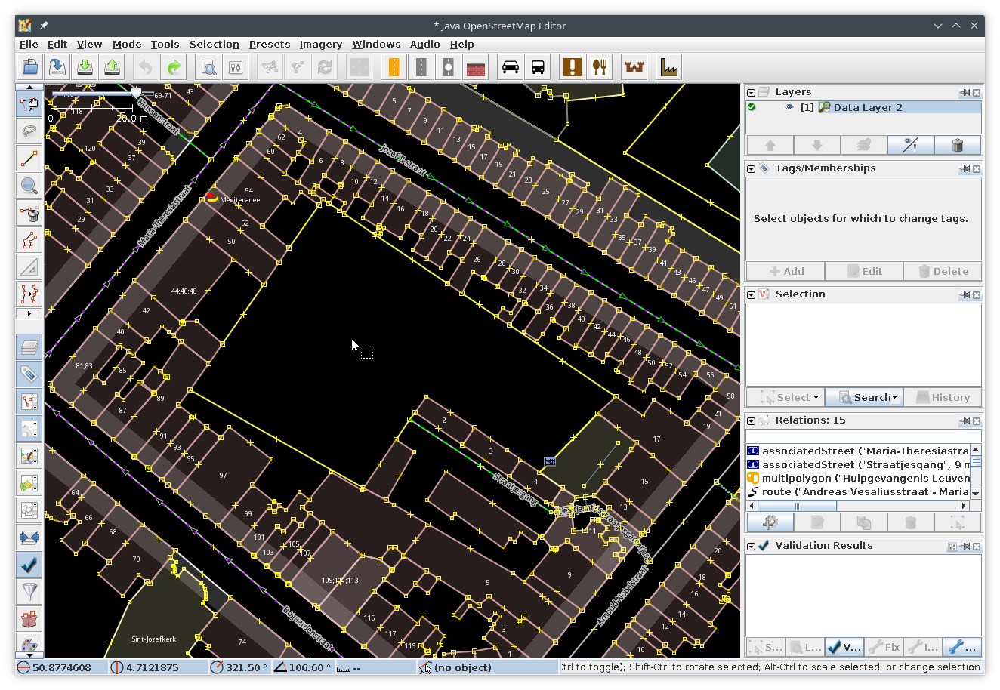

Way created
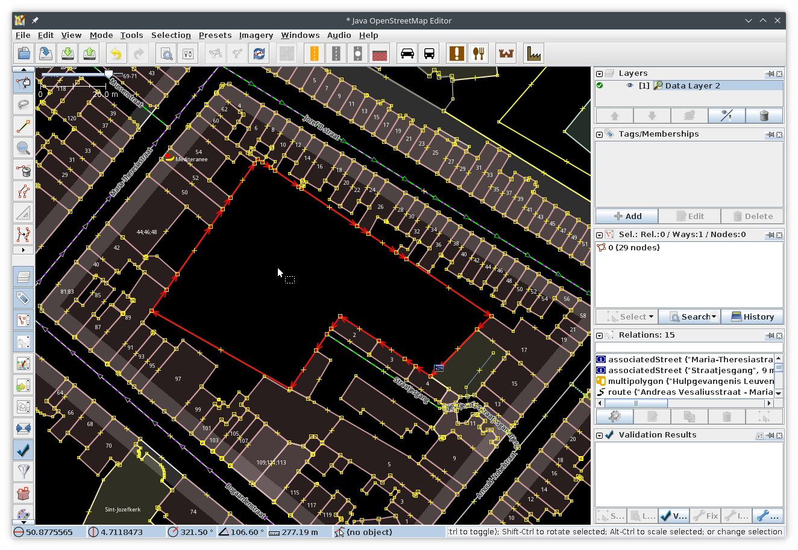

Add leisure tag
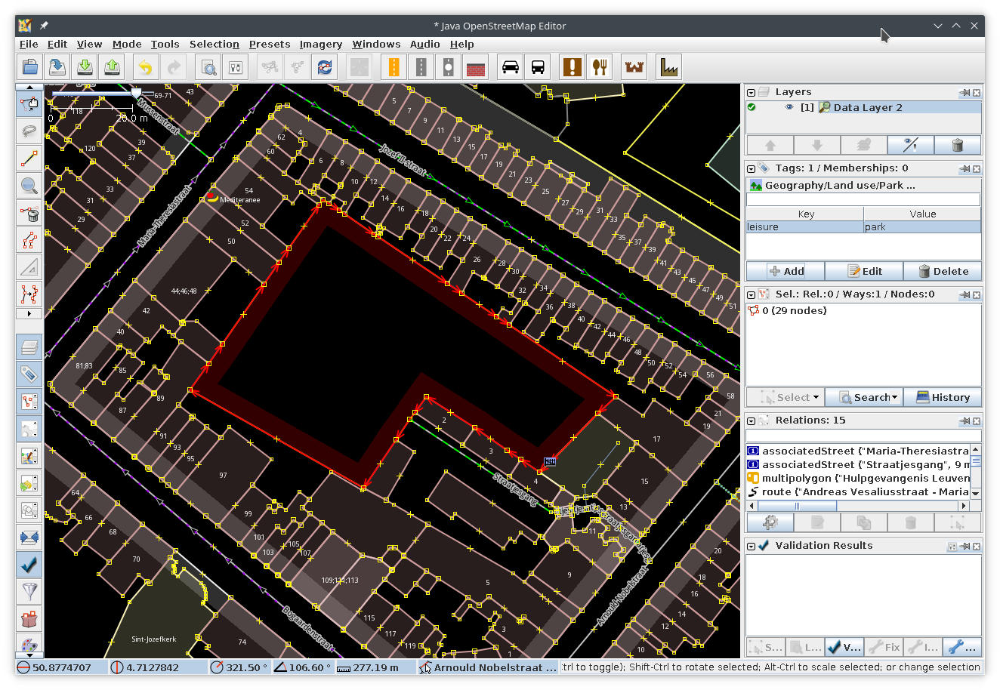
