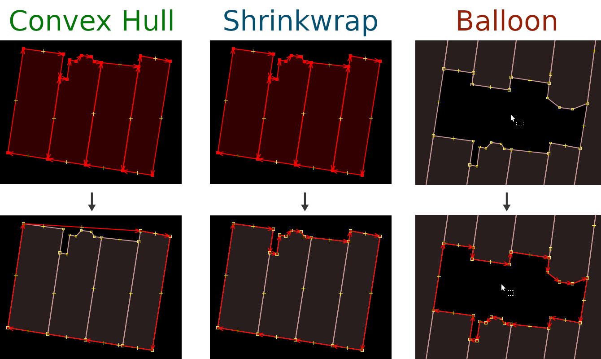

# Shrinkwrap JOSM Plugin

*Shrinkwrap* is a [JOSM](https://josm.openstreetmap.de/) plugin that offers three actions to create:

* [A convex hull around the selection](USAGE.md#convex-hull)
* [A "shrinkwrapped" way (concave hull) around the selection](USAGE.md#shrinkwrap)
* [A "ballooned" way (inner concave hull?) around the cursor](USAGE.md#balloon)

[Usage](USAGE.md)  
[Examples](EXAMPLES.md)




## Installation

In JOSM, go to ```Menu Bar > Edit > Preferences > Plugins``` and search for "shrinkwrap".


## Bugs, suggestions etc.

Create an issue on [github](https://github.com/ubipo/shrinkwrap) or contact me on [osm](https://www.openstreetmap.org/user/Ubipo).


## Contributing

Written in [Kotlin](https://kotlinlang.org/) using [Florian Schäfer's](https://gitlab.com/floscher) excellent [Gradle plugin](https://gitlab.com/floscher/gradle-josm-plugin).

Found a bug and know the cause?  
Made an improvement?  
I'm open to any pull request or suggestion.
